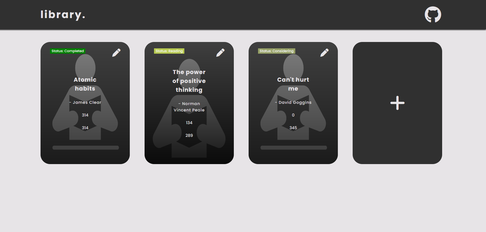
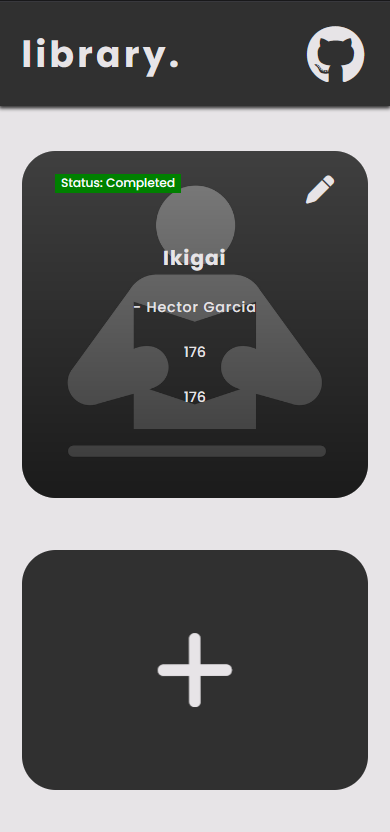

# Project Library

## Table of contents

- [Overview](#overview)
  - [The challenge](#the-challenge)
  - [Screenshot](#screenshot)
  - [Links](#links)
- [My process](#my-process)
  - [What I learned](#what-i-learned)
- [Author](#author)
- [Acknowledgments](#acknowledgments)

## Overview

### The challenge

User should be able to:

- Input book name, author name, and other inputs like total number of pages and number of pages read
- Based on Total number of pages and number of pages read, Status should be shown accordingly (Considering, Reading, Completed)
- View the optimal layout for the component depending on their device's screen size
- Ability to add multiple records

### Screenshots

### Links

- Live Site URL: [live site here](https://rojansr.github.io/Odin-library/)

## My process

### Built with

- Semantic HTML5
- CSS
- Vanilla JS

### What I learned

- Ability to create new element in DOM
- Store input value
- Apply conditions based on input values
- Choosing correct combination of color pallete

## Author

- Email - rairojan1116@gmail.com

### Acknowledgements

Completely Solo Project
